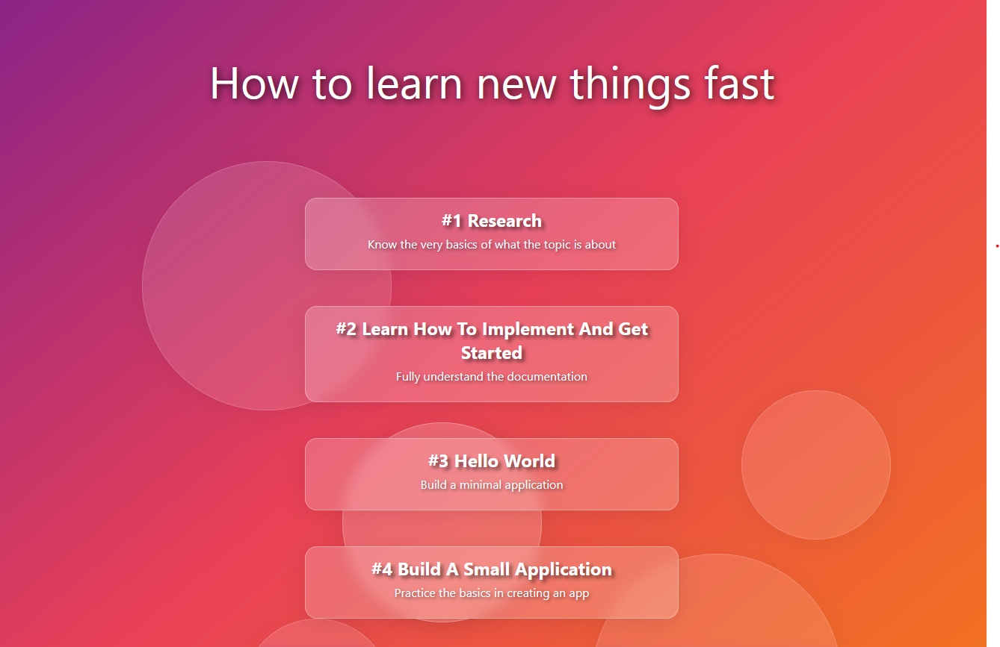

# Glassmorphism Learning Guide

A modern web application showcasing learning steps with frosted glass effects, gradient backgrounds, and animated elements.

## Features
- Frosted glass panels
- Gradient background
- Floating circle animations
- Responsive design

## Preview

## Technologies
- HTML5
- CSS3 (Glassmorphism, Gradients)
- Google Fonts (Inter)
